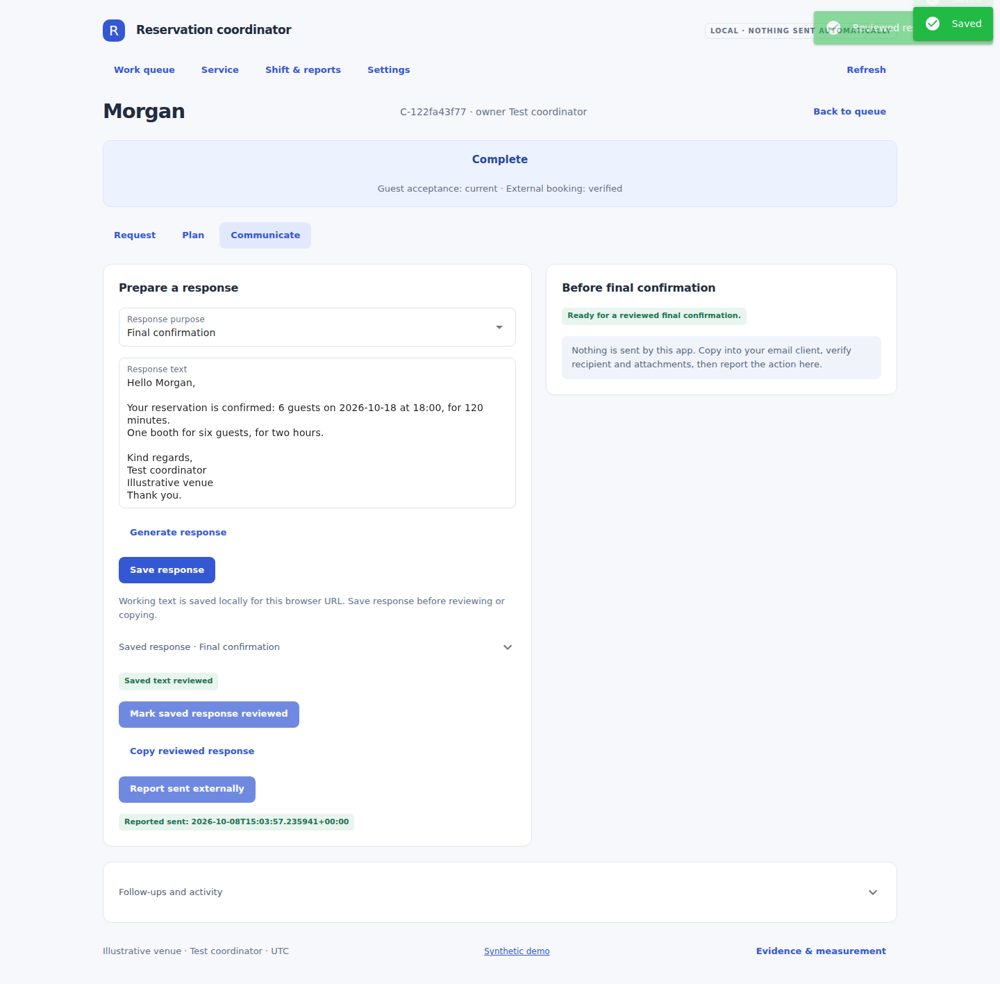

# Reservation Operations Workbench · 3.0

A local, human-reviewed reservation coordinator workspace: prepare a shift from an OpenTable export, organize inquiries, review arrangements, document external booking actions, obtain guest acceptance, prepare reviewed responses, and hand bookings to service staff.

**Sole developer: Cameron Hendey. Original workflow developed at JOEY in 2024; refined in 2025.** The original workflow used LLM chat tools and manual booking operations. This repository is its later software implementation. Software verification records carry their actual run dates, not backdated employment dates.



## Run in Cursor

Requires Python 3.11+. No Node.js or frontend build step. In **Terminal → New Terminal**, run:

```powershell
cd "C:\Users\camer\Documents\dev\reservation-workbench"
py -m venv .venv
.\.venv\Scripts\python.exe -m pip install -c constraints-tested.txt -e .
.\.venv\Scripts\python.exe app.py
```

Skip environment creation if `.venv` already exists. Open **http://localhost:8080**. Keep the terminal open; Ctrl+C stops the server. For subsequent launches run only the final command, or `start-windows.cmd`.

When upgrading: stop the app, back up your existing `data` folder, and copy the contents of the ZIP's `reservation-workbench` folder into your existing project. Keep your `.env`, `.venv`, and databases. Re-run installation. Do not create a nested project folder.

## Two deliberately separate workspaces

| Location | Purpose | Data |
|---|---|---|
| `/` | Coordinator workflow, actual clock, reviewed restaurant configuration | Starts empty; `data/coordinator/workbench.sqlite` |
| `/demo` | Preserved synthetic seating engine, optional live interpreter, worked examples and study harness | Existing demo/session databases and synthetic fixtures |

No legacy database is migrated or deleted. The old demo's **session** database can contain synthetic bookings; it is not the new empty coordinator workspace. Set `RW_COORDINATOR_DB` only if you need a different local path. Keep the server bound to `127.0.0.1`.

## Working sequence

1. **Start shift.** Identify the coordinator and restaurant. Review current policy, actual tables, allowed groupings, occupancy assumptions, calling hours and separate spend/manager thresholds in Settings.
2. **Prepare reports.** Upload CSV/TSV, review mappings, date order, time zone, export time and coverage, validate, then explicitly apply. A new shift requests fresh reports; reloads preserve them. If unavailable, record a manual-check reason.
3. **Request.** Capture email, phone, paper or internal intake using its original received time. Review requirements and exact-source extraction suggestions. Historical notes never automatically become confirmed facts.
4. **Plan.** Define seating and terms. Check snapshot conflicts, then verify current availability and restaurant flow manually. Record approvals and saved external bookings. Select an approved seating photo or document an exception. Record guest acceptance from an exact message/call quote.
5. **Communicate.** Generate/edit a purpose-specific response, save, review, copy, send in your email client, then report that external action. Final confirmation has explicit prerequisites. Follow-ups remain open until completed.
6. **Service.** Review the saved external allocation, requirements, promises and pending changes. Record who reviewed the handoff; later changes are flagged. Export a spreadsheet-safe CSV.

Full instructions: [Operator guide](docs/OPERATOR_GUIDE.md).

## Technical value

- Version-bound guest acceptance, external verification, manager approval and response review. Changes invalidate relevant evidence without discarding the saved external allocation.
- SQLite transactions and revision checks reject stale-tab writes. Before/after audit events preserve decisions. Independent browser-URL draft buffers survive reloads.
- Schema-adaptive OpenTable parsing: explicit preview/apply, identity checks, coverage/freshness warnings, replacement and stable-ID reconciliation. No guessed dashboard schema.
- Conservative snapshot assistance using known table IDs, allowed groups, capacity, step-free constraints, overlap buffers and estimated occupancy. Newer manually verified bookings are considered; absence never cancels a booking.
- Structured calls, unknown/historical/confirmed requirements, owners, deadlines, follow-ups and staff review receipts.
- Synthetic regression tests and real browser journeys, not fabricated productivity metrics.

See [Architecture](docs/COORDINATOR_WORKFLOW.md), [Manual-to-software traceability](docs/COORDINATOR_TRACEABILITY.md), and [Verification](docs/VERIFICATION.md).

## Important boundaries

This is a **single-operator local prototype**, not a production deployment or certified OpenTable integration. It never sends email, calls guests, modifies OpenTable, takes payment, or autonomously guarantees availability. `Potentially feasible` is a conditional snapshot result. Staffing/pacing, day-specific table preferences, booth preferences, variable actual dining duration and unusual accessibility needs still require human judgment.

The new coordinator uses **offline pattern extraction**, explicitly not an LLM. `/demo` retains optional live-provider code; real guest data is not silently sent to it. Live-model evaluation is **not run**. The original ~45→5 minute manual-workflow figure is an owner estimate, not a software benchmark. A controlled human study remains pending.

Use synthetic/anonymized records for portfolio demonstrations. The local database is not encrypted and has no authentication. Raw reports are logically removed at shift end or after 24 hours on next report access, not by a guaranteed background purge. Copied evidence, messages, drafts, audit history and photos persist separately. Closed cases can be explicitly removed; this is not forensic erasure and does not purge backups or external systems. The original manual and its credentials are excluded from this release.

## Development

```bash
python -m pip install -c constraints-tested.txt -e '.[dev]'
python -m pytest
python -m playwright install chromium --only-shell
python scripts/run_release_checks.py
```

The check runner uses temporary databases, fictional guests and ports 8623–8626. It records actual output under `results/verification/`. Set `RW_CHROMIUM` to an existing Chromium executable if needed. The coordinator schema is independent of the legacy schema.

Earlier releases and their evidence remain under `docs/archive/`. The older 39/40 result is a retest of inspected synthetic demo cases, not a fresh blind benchmark and not evidence of v3 operational time savings.
