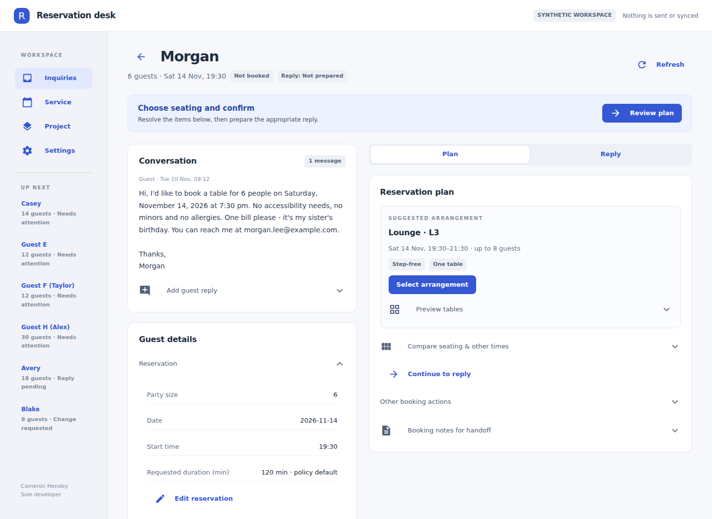

# Reservation Operations Workbench

A local, human-reviewed workbench for large-party restaurant reservation inquiries. It uses a **simulated restaurant** ("Harbour Table Demo") with **synthetic fixtures**, and can optionally load read-only, operator-uploaded OpenTable reports.

The app turns guest emails into typed facts with quoted evidence, checks seating with deterministic rules, records holds, confirmations, changes and cancellations in a local demo database, and prepares reviewed draft replies for you to copy elsewhere.

Nothing in this application sends email, connects to or updates an external booking system, or takes payments. Uploaded CSV/TSV exports are parsed locally as read-only snapshots. This is a single-operator prototype, not a deployed production service.



## Status (version 2.1)

| Gate | State |
|---|---|
| Implemented | Workbench UI, service layer, rules engine, offline and live interpreters, CLI, evaluation runner, study harness |
| Deterministic tests | **153 passed** (`pytest`), covering acceptance scenarios A01-A30 |
| Actual UI verified | Chromium captures at 1440 px, 820 px and 390 px; three real NiceGUI browser journeys plus retained legacy UI tests ([docs/VERIFICATION.md](docs/VERIFICATION.md)) |
| Live model verified | **not_run**: no API key or spending limit was supplied ([results/eval/live_status.json](results/eval/live_status.json)) |
| Human handling-time study | **pending**: harness and protocol ready, 0 of 36 sessions recorded |

The original 40-case blind offline run allowed the expected next action in **33/40** cases with **1 critical-error case**. The refinement regression run reaches **39/40** with **0 critical-error cases** and 97/97 labelled field agreement. This is a **retest of previously inspected synthetic cases**, not a fresh blind benchmark; making occasion optional explains two improved next-action results. Live AI performance and time savings remain unmeasured. [Evaluation and limitations](docs/EVALUATION.md).

Version **2.1** adds a session-start OpenTable export workflow: upload, review column mappings, validate, then explicitly apply a read-only report. Optional guestbook imports add exact-contact candidate records. Inquiry plans show report-date totals, provenance and coverage/freshness warnings. Reports never silently change facts, seating availability or drafts. [Import guide and evidence boundaries](docs/OPENTABLE_IMPORT.md).

Version **2.0** replaces the primary interface with NiceGUI: compact inquiry rows, a conversation-and-decision workspace, focused reply editing, mobile Request/Plan/Reply views, and arrival briefs. Business rules and the SQLite schema are retained. [Migration and workflow coverage](docs/NICEGUI_MIGRATION.md).

Version **1.2** simplified navigation, separated booking and reply progress, grouped editable details, added explicit unknown-value clearing, and put arrival briefs first. [UI changes and decisions](docs/UI_REDESIGN.md).

Version **1.1** added a unified coordinator workspace, typed guest-detail editing, selected-plan drafting, seating/time comparisons, outgoing conversation history, explicit referral reporting and a daily handoff export. [Changes](docs/REFINEMENT.md).

## Requirements

- Python 3.11 or later
- A terminal in the project directory

NiceGUI is the main UI. No Node.js, npm or frontend build is required. The offline demo needs no API key.

## Quick start

From the project root:

```bash
python -m venv .venv
```

Activate the environment, then install and run:

**Windows (PowerShell)**

```powershell
.\.venv\Scripts\Activate.ps1
python -m pip install -c constraints-tested.txt -e .
python app.py
```

**macOS / Linux**

```bash
source .venv/bin/activate
pip install -c constraints-tested.txt -e ".[dev]"
cp .env.example .env          # optional; offline mode is the default
python app.py
```

Open **http://localhost:8080**. Keep the terminal running; Ctrl+C (or Cmd+C) stops the app.

On Windows, `start-windows.cmd` runs the same launch command after the environment exists. Later launches only need `python app.py` with the virtual environment active (or `.\.venv\Scripts\python.exe app.py` without activating).

When upgrading an existing install, stop the previous app first. Keep your `.env`, `.venv` and existing `data` databases, then re-run the installation command above. The database schema has not changed. Avoid nesting a second copy of the project inside itself.

## Using the workbench

Every new browser page or reload opens **Prepare your session**. Upload a reservations CSV/TSV, check the mappings and settings, select **Validate report → Use this report**, then **Open workbench**. Add a guestbook only when needed. To explore the fixtures, select **Use synthetic demo without exports**.

The workbench opens on the **demo** database (`data/demo/workbench_demo.sqlite`), seeded from `data/synthetic/demo_inquiries.json` with a fixed demo clock of Tue Nov 10 2026, 10:00 America/Toronto. Use **Advance 1 hour / Advance 1 day** in **Settings** to move the demo clock (holds expire against it). Switch to the **session** database for a persistent workspace on the real clock.

Day-to-day operator steps are in the [operator guide](docs/OPERATOR_GUIDE.md).

### What you can do

- Queue sorted by urgency and deadline; add or paste messages; import CSV with row-level errors.
- Facts with status (known, unknown, needs review, conflict, operator-confirmed), quoted evidence and change history. Operator values are never overwritten by later guest text; disagreements become conflicts.
- Seating check over tables and groupings with reasons for every rejected option, checked alternative times, split-seating disclosure, and a private-events route above 25 guests.
- Proposals bound to a record version; review and commit a demo hold (reserving every constituent table until expiry), record a demo confirmation, commit a change atomically, record a cancellation, release, decline or escalate. Each action is idempotent.
- Minimum spend and allergies require a recorded human decision; nothing is guaranteed to the guest.
- Drafts from templates with deterministic validators; edit, mark reviewed, copy or export. Exports do not send anything. A separate operator assertion adds the exact reviewed reply to conversation history.
- Configuration-derived seating schematic and time comparisons; service occupancy grid, daily handoff CSV, and an arrival-bucket heuristic (not a kitchen-capacity model).
- Operator study timer and protocol; no synthetic time-saving claims.

## Command-line tools

With the environment installed:

```bash
rw init-demo                    # create/seed the demo database if missing
rw reset-demo                   # delete and re-seed ONLY the designated demo database
rw queue                        # queue as text
rw show INQ-0103 --notes        # facts, rules and copyable booking notes
rw import-csv messages.csv --interpret          # into the session database
pytest                                          # 153 tests
rw eval validate                                # dataset shape and freeze hash
rw eval run --split heldout --mode offline      # writes results/eval/<run>/
python scripts/run_worked_examples.py           # replays examples/01-03
python scripts/make_charts.py                   # historical evaluation figures
python scripts/capture_nicegui.py                # current screenshots; needs Playwright Chromium
```

`reset-demo` refuses any path other than the designated demo database and refuses any database whose stored kind is not `demo`.

For development and testing, install extras:

```bash
pip install -c constraints-tested.txt -e ".[dev]"
```

## Demo versus live interpreter

| | Offline (default) | Live (optional) |
|---|---|---|
| What reads the email | Deterministic pattern rules in `providers/offline.py` | Anthropic Messages API with JSON-schema output, validated again locally |
| Needs | nothing | `RW_PROVIDER=live` and `ANTHROPIC_API_KEY` in `.env` |
| Honesty | Labelled "offline pattern rules (not a language model)"; unsupported text is returned as `unsupported` for manual interpretation | Every quote must exist verbatim in a guest message; invalid output is retried a bounded number of times, then fails visibly |

In both modes seating, policy checks, booking state and the critical facts in drafts (dates, times, party size, tables, status) come from deterministic code. A live model may only write a greeting line and a closing line, and validators reject digits or booking/policy words in that prose.

Live evaluation runs only with a key **and** explicit limits:

```bash
rw eval live --max-calls 400 --budget-usd 5 --usd-per-mtok-input <rate> --usd-per-mtok-output <rate>
```

Without them it writes `results/eval/live_status.json` with `status: not_run` and reports no live numbers.

## Repository map

| Path | Contents |
|---|---|
| `src/reservation_workbench/domain` | Typed models, config loading, clocks |
| `src/reservation_workbench/rules` | Fact reconciliation, availability engine, assessment (next action, rule results) |
| `src/reservation_workbench/providers` | Offline interpreter, live Anthropic provider, shared validation |
| `src/reservation_workbench/services` | Workbench service layer (used by UI, CLI, tests and evaluation), drafting, CSV import, bootstrap/reset |
| `src/reservation_workbench/persistence` | SQLite schema and repository (events, idempotency keys) |
| `src/reservation_workbench/web` | NiceGUI interface, command boundary and visual system |
| `src/reservation_workbench/ui` | Optional legacy Streamlit interface |
| `src/reservation_workbench/evaluation`, `data/eval` | Scenario loader, freeze, runner; 20 development + 40 held-out scenarios |
| `src/reservation_workbench/study`, `data/study`, `docs/study` | Handling-time study harness, cases and protocol |
| `config/restaurant_demo.yaml` | Synthetic restaurant: tables, groupings, policies, seed bookings |
| `examples/` | Three replayable worked examples |
| `results/eval/` | Every saved evaluation run, including the first blind run |
| `docs/` | Documentation, diagrams, figures, screenshots |

## Documentation

[Domain and policies](docs/DOMAIN_AND_POLICIES.md) · [Operator guide](docs/OPERATOR_GUIDE.md) · [OpenTable import](docs/OPENTABLE_IMPORT.md) · [Decisions](docs/DECISIONS.md) · [Evaluation](docs/EVALUATION.md) · [Verification](docs/VERIFICATION.md) · [Claims](docs/CLAIMS.md) · [Build status](docs/BUILD_STATUS.md)

## Scope boundaries

Synthetic restaurant and guests only. Policies in `config/restaurant_demo.yaml` are demonstration values, not any real restaurant's current policy. No real guest data, no restaurant branding, no affiliation with or integration into any reservation platform, no deployment. All guest text is treated as untrusted data and never as instructions.

The server binds to `127.0.0.1:8080`. `RW_PORT` can change the port. There is no login, role permissions or production deployment configuration.

License: MIT.

## Legacy interface

The previous Streamlit UI remains available for comparison and recovery:

```bash
python -m pip install -c constraints-tested.txt -e ".[legacy]"
python -m streamlit run streamlit_app.py
```

Use `python app.py` for the current interface. Do not run `streamlit run app.py`. Both interfaces use the same configured database, so run one interface at a time during normal use.
