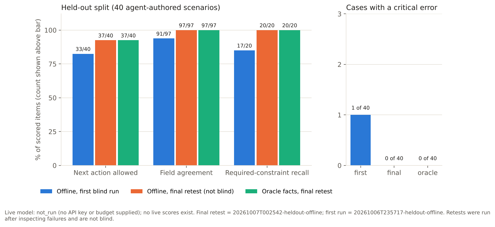

# Evaluation

Sole developer: Cameron Hendey. Original workflow developed at JOEY in 2024; refined in 2025.

**Read this first.** All 60 scenarios and their labels are synthetic and were authored within this development process using coding tools; they were not supplied by independent evaluators. The development split was used to tune the rules and interpreter. The first held-out run was blind; every later held-out run is a **retest** made after inspecting held-out failures. No live language model has been evaluated (`not_run`). These numbers are engineering checks of this implementation against its own specification, not an independent benchmark.

The figure below records the original release, not the 1.1 refinement.



Generated by `python scripts/make_charts.py` from the `summary.json` files listed in [figures/figures_manifest.json](figures/figures_manifest.json).

## Dataset

- `data/eval/scenarios_dev.yaml`: 20 development scenarios (includes the 6 seeds from the build kit, checked against the engine).
- `data/eval/scenarios_heldout.yaml`: 40 held-out scenarios in the required groups: ordinary 6, missing/conflicting 6, capacity/accessibility 6, overlap/hold/time 6, modification/cancellation 6, oversized/minimum spend 4, service/allergy 3, adversarial/unsupported 3. 22 contain more than one message.
- Each scenario has a fixed reference clock, optional setup bookings or an existing booking, steps (guest messages, operator corrections, proposals, holds, confirmations, clock moves), and expectations: field values, provenance message, allowed next actions, required and forbidden rules, prohibited draft claims, whether a commit is allowed, and critical rules.
- Frozen before the first held-out run: `data/eval/FREEZE.json` (dev `3592494d77e4...`, held-out `d731ee1ec2c7...`). `rw eval validate` checks the hashes; the freeze command refuses to overwrite. Held-out labels were corrected once for phrasing before the freeze. One development label (DEV-18) was revised before the freeze; see [DECISIONS.md](DECISIONS.md) D23.
- Gold labels are never passed to either interpreter.

## Modes

| Mode | What it measures |
|---|---|
| `offline` | The whole pipeline with the offline pattern interpreter: extraction, fact resolution, rules, next action and drafts |
| `oracle` | The same, plus operator corrections that set the labelled literal values before scoring. It isolates the rules engine and drafting from extraction errors. It is not a model result |
| `live` | The same pipeline with the Anthropic provider, 3 repeats per held-out case (120 case runs), every attempt and retry recorded with tokens, latency, prompt hash and settings. **Requires a key, a call cap, a USD budget and token rates. Not run.** |

## Metrics

| Metric | Definition |
|---|---|
| Field agreement | labelled fields whose resolved value matches (normalized exact; `unknown` must stay unknown, `review` must be needs_review/conflict) |
| Provenance validity | accepted citations whose quote appears verbatim in the cited message; separately, labelled fields whose cited message matches the label |
| Next action allowed | final next action is in the scenario's allowed set |
| Required-constraint recall | required rule IDs raised / required rule IDs |
| False warnings | forbidden rule IDs raised |
| Prohibited claims | deterministic phrase checks per draft (global: any external booking system named, "has been sent", "guaranteed"; plus per-scenario phrases); drafts affected and total claims |
| Critical errors | a wrong party size, date, time, accessibility or allergy value; a missed critical rule; a commit-type next action (hold, confirm, change) where no commit is allowed |

Denominators include every case; provider failures stay in the denominator.

## Results

Held-out split, 40 cases, offline interpreter unless noted. All runs are in `results/eval/` with `run.json`, `summary.json`, `cases.jsonl` and `report.md`.

| Run | Status | Next action | Fields | Constraint recall | Provenance verbatim | Critical-error cases (errors) |
|---|---|---|---|---|---|---|
| `20261006T235717-heldout-offline` | **first blind run** | 33/40 | 91/97 | 17/20 | 251/251 | 1 (3) |
| `20261006T235718-heldout-oracle` | blind, oracle facts | 37/40 | 97/97 | 19/20 | 251/251 | 0 |
| `20261006T235823-heldout-offline` | retest 1 | 36/40 | 97/97 | 19/20 | 261/261 | 1 (1) |
| `20261006T235947-heldout-offline` | retest 2 | 36/40 | 97/97 | 20/20 | 261/261 | 1 (1) |
| `20261007T000920-heldout-offline` | retest 3 (regression found) | 36/40 | 97/97 | 19/20 | 261/261 | 1 (1) |
| `20261007T001014-heldout-offline` | retest 4 | 36/40 | 97/97 | 20/20 | 261/261 | 1 (1) |
| `20261007T001109-heldout-offline` | retest 5 | 37/40 | 97/97 | 20/20 | 261/261 | 0 |
| `20261007T002542-heldout-offline` | **retest 6, final, clean commit** | **37/40** | **97/97** | **20/20** | 261/261 | **0** |
| `20261007T002543-heldout-oracle` | retest 6, oracle facts | 37/40 | 97/97 | 20/20 | 261/261 | 0 |
| live | **not_run** | - | - | - | - | - |

Across every run: 0 false warnings, 0 drafts with prohibited claims (38 drafts per run), 0 drafts with validator errors, 0 provider failures, 0 citations rejected by the evidence validator. Provider statuses per run: 54 ok, 4 partial, 4 unsupported (62 interpretation calls). Offline runs take under half a second; token usage 0; cost not applicable.

Development split (`20261007T002544-development-offline`, tuned against): next action 19/19 scored, fields 77/78, constraint recall 15/15, 0 critical-error cases. The one field miss is DEV-10 (`split_seating_ok` expected `yes`, left unknown).

Oracle equals offline from retest 1 onward because, after the fixes, the offline interpreter matched every held-out field label. That is a consequence of fixing failures seen on this split, not evidence of general extraction quality; the first blind run (91/97) is the better estimate for unseen text.

## What the first blind run found and what changed

Six field misses, all party size, and three missed required rules:

| Case | Failure in first blind run | Change | Commit |
|---|---|---|---|
| HO-CAP-02 | **Critical (3 errors)**: "Twenty people..." then "two guests use wheelchairs" made the party size 2, so R-NO-OPTION was missed and the engine recommended confirmation | A count followed by a verb such as "use", "need", "have" or "are allergic" is a subgroup, not the party size | `d2a508e` |
| HO-CAP-01 | "One of us uses a wheelchair" produced a competing party size of 1 (sent to review, so not critical) | Same subgroup rule | `d2a508e` |
| HO-ORD-03, HO-ORD-05, HO-TIM-05 | "dinner for 7" style, "...12:30 pm for 6", "table L2 for 4" not read as party size (left unknown) | Added "party/table/dinner/lunch... for N" and trailing "for N" forms | `d2a508e` |
| HO-ORD-06 | "Lunch for two" not read (left unknown) | Same pattern change | `d2a508e` |
| HO-CAP-04 | Required R-ACCESS-CONFLICT (step-free guest asking for the mezzanine) not raised | New review rule | `088d2ba` |
| HO-TIM-05 | R-PREF (requested table taken) not raised, because party size was unknown | Raised once party size was read | `d2a508e` |

Later retests:

- **Retest 1-4, HO-CAP-04 (critical)**: the engine raised the review but still recommended a demo hold on a step-free substitute where the label forbids any commit. The engine was changed so an access/area conflict goes to operator review before any hold (`dedb30a`). The label was not changed.
- **Retest 3, HO-CAP-05 (regression)**: after a ranking change that put explicit table requests first (made while replaying worked example 3), a request for the 5-seat table L2 for 7 guests was "satisfied" by the 25-seat grouping L1+L2 split across two tables, and R-PREF was no longer raised. Fixed so only the requested table itself honours a table request (`fd9fe2b`), with a regression test.

## Remaining held-out failures (final retest)

| Case | Expected | Got | Cause |
|---|---|---|---|
| HO-ORD-01 | confirm_booking | operator_review | Offline interpreter marks "nobody needs step-free access" as ambiguous rather than `none`. Safe direction (asks a human) |
| HO-ORD-02 | confirm_booking | create_hold | Occasion "Book club" not recognised, so occasion stays missing and the engine recommends a hold while asking for it |
| HO-TIM-05 | confirm_booking or operator_review | create_hold | Occasion "brunch" not recognised (same cause). The noon-crossing collision on L2 is detected and no draft claims table L2 |

These were deliberately not fixed: they are offline-interpreter phrase coverage gaps, and tuning further on this split would make the numbers less meaningful. None is a critical error. Other known offline gaps: "around 6:30" goes to review, and sign-offs such as "Thanks, Morgan" are left uninterpreted.

## Limitations

- Labels and scenarios are agent-authored; no independent review. Scenarios share the author's assumptions with the engine.
- 40 held-out cases is small; each next-action point is 2.5 percentage points.
- Retests are not blind. Five rounds of fixes were informed by held-out failures.
- `code_version` in runs before retest 6 records the HEAD commit at run time; some fixes under test were committed just after their run (the following commit in the table above). From retest 6, uncommitted source changes are flagged as `+uncommitted`.
- The offline interpreter is a pattern matcher with narrow coverage. Real guest email would produce many more `unsupported` and review items.
- No live model results exist. Nothing here estimates how a language model would score.
- Draft checks are deterministic phrase and number checks. Semantic quality (tone, clarity) was not judged, and no LLM judge was used.

## Running it

```bash
rw eval validate
rw eval run --split heldout --mode offline --retest "why this is a retest"
rw eval run --split heldout --mode oracle --retest "..."
rw eval live --max-calls N --budget-usd X --usd-per-mtok-input A --usd-per-mtok-output B   # needs ANTHROPIC_API_KEY
python scripts/make_charts.py
```

The live command records every attempt (including failed ones) in `calls.json`, stops at 90% of the budget or before the call cap could be exceeded, and marks unrun cases as `not_run_budget` rather than dropping them. Without a key or limits it writes `results/eval/live_status.json` with `status: not_run`.

## Handling-time study

No sessions have been recorded, so no handling-time results exist. The harness, protocol, cases, method materials and timer are ready: [study/PROTOCOL.md](study/PROTOCOL.md), `rw study plan`, the Operator study view, `rw study export`. `python scripts/make_charts.py` writes [figures/handling_time_status.json](figures/handling_time_status.json) with `pending` until real sessions exist. Cameron's historical ~45 to ~5 minute estimate is not a result of this project; see [PROVENANCE.md](PROVENANCE.md).

## Version 1.1 regression

The refinement run in `results/eval/20261006T222849-heldout-offline/` is the current regression record: **39/40 next-action matches, 97/97 labelled fields, 20/20 required constraints, 0 critical-error cases**, and 0 phrase-validator errors in 38 generated drafts. HO-ORD-01 remains an operator-review mismatch. The original first blind run remains 33/40 with 1 critical-error case; the original final retest was 37/40 with none.

This is not a new held-out evaluation. All 40 cases have previously been inspected. Two additional next-action matches come from making occasion optional, not from improved language understanding. Frozen source files and hashes have not changed. The runtime recorded this run earlier than timestamps in the supplied package; original timestamps are preserved rather than rewritten.

The 15 new refinement tests target reproduced defects and complete UI workflows. They are implementation regression checks, not independent model evaluation. The live API and real operator study remain unrun.

## Supplemental first-pass challenge

Twelve additional synthetic cases were written after the refinement and frozen before execution (`data/eval/refinement_challenge.json` and `.sha256`). The first pass produced **31/32 field matches**, preserved all **6/6 labelled unknowns**, and raised no draft-validator errors in 11 generated drafts. RC03 conservatively marks the wording “Nobody in our group needs step-free access” for review instead of treating it as confidently resolved. No parser changes were made in response to this challenge.

This small development-authored set scores field extraction only: next-action and constraint metrics have **zero denominators**, so no action-accuracy claim is made. It is not independently authored or representative of real guest email. Results: `results/refinement-challenge/`. Replay with `PYTHONPATH=src python scripts/run_refinement_challenge.py --out results/challenge-replay`; the script refuses to overwrite the saved first pass.
