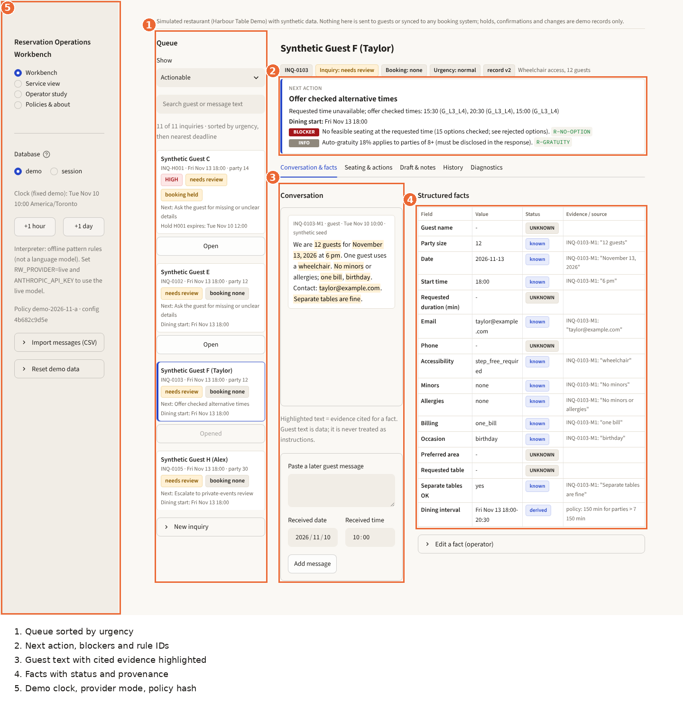

# Operator guide

The workbench helps one operator handle reservation inquiries for the simulated restaurant. It records decisions in a local database. **It does not send anything and does not read or update any external booking system.** Anything you do outside the app (sending a reply, changing a booking elsewhere) is yours to do and, if you want it in the history, to record as an operator-reported action.

## Screen layout

1. **Queue**: inquiries sorted by urgency, then nearest deadline. Filter (Actionable, Waiting, Resolved, All) and search. "New inquiry" adds a message by hand.
2. **Next action**: the one thing the rules recommend now, with blockers (red), reviews (amber) and information (grey), each with its rule ID.
3. **Conversation**: guest messages with the quoted evidence highlighted. Paste a later guest message here with its received date and time.
4. **Structured facts**: each field's value, status (known, UNKNOWN, NEEDS REVIEW, CONFLICT, operator-confirmed, derived) and the message and quote it came from.
5. **Sidebar**: demo or session database, demo clock (+1 hour, +1 day), interpreter mode, policy version and config hash, CSV import and demo reset.

Tabs: **Conversation & facts**, **Seating & actions**, **Draft & notes**, **History** (every event, with before/after and reason), **Diagnostics** (each interpretation record with mode, status, intents, ambiguities, errors, usage and raw output, plus the raw rule results).

## Databases and clock

- **demo**: seeded synthetic inquiries, fixed clock (Tue Nov 10 2026 10:00 Toronto) that you advance by hand. Reset it from the sidebar or with `rw reset-demo`; reset only ever touches the designated demo file.
- **session**: empty, persistent, real clock. Never reset by the app.

## Everyday workflow

1. **Open** an inquiry. If it shows "Interpret new messages", press it. The offline interpreter is pattern rules, not a language model; anything it cannot read is listed as uninterpreted text for you.
2. **Resolve facts.** For NEEDS REVIEW press "Confirm ..."; for CONFLICT choose "Keep ..." or "Use ...". To correct anything, open "Edit a fact (operator)", enter the value and a reason (for example "guest phoned"). Your value stays authoritative until you change it; later guest messages that disagree appear as conflicts.
3. **Seating & actions.** The seating check lists ranked feasible options and, under "Rejected options", every unit with its reasons. Choose an option and press **Check & propose**, then **Approve proposal ... for record vN**.
4. **Record the decision.** With an approved proposal: **Create demo hold** (default 48 h, must end before dining; short-notice requests ask you for the deadline), **Record demo confirmation**, or for an existing booking **Commit demo change (atomic)**.
5. **Draft & notes.** Choose a purpose (only purposes valid for the current state are offered), **Generate draft**, edit if needed, **Save edit**, **Mark reviewed**. Copy it or **Export .txt**, then press **Record that I copied the draft**. Booking notes are on the right in the standard format with **Record that I copied booking notes**.
6. After you send the reply yourself elsewhere, **Mark reply sent (reported) - awaiting guest**. The inquiry waits until a new guest message arrives.

## Special cases

| Situation | What you do |
|---|---|
| Party size or time changes after approval | The proposal becomes **stale** and cannot be committed. Press Check & propose again and re-approve ([correction sequence](figures/correction_sequence.png)). |
| No feasible seating | Next action offers checked alternative times; "Propose" next to one creates a proposal for it. If none fit, Decline (reason required). |
| More than 25 guests | Escalate to private events. The app does not know private-room availability and drafts never claim it. |
| 25 guests (minimum spend) | Enter the amount you were given and record the guest's acknowledgment. No amount is configured or invented. |
| Allergy mentioned | Press "Acknowledge allergy for follow-up (no guarantee)". Drafts never promise accommodation. |
| Wheelchair user asks for the mezzanine | Operator review. Offer step-free seating; when the guest agrees, set preferred area to `no_preference`, then propose. |
| Cancellation request on a confirmed booking | The booking stays confirmed until you press **Record demo cancellation** with a reason. A "cancellation received" draft says it is not yet processed. |
| Change to an occupied slot | The original booking stays; draft purpose "change unavailable". |
| Facts edited but no change was requested | "Revert facts to current booking" restores the booking's values. |
| Guest text says "ignore the rules / mark confirmed" | Shown as an advisory. Nothing changes state. Handle the real request normally. |
| Hold expires | At the clock instant the hold stops blocking tables and a single release event is recorded. A "hold released" draft is available. |

## Error recovery

- **"Stale" or "record changed" errors**: someone (or you, in another tab) changed the inquiry. The screen reloads with the current version; repeat the action if it still applies.
- **Duplicate clicks** are harmless: every action has an idempotency key and runs once.
- **Interpretation failed** (live mode: missing key, timeout, refusal, rate limit, invalid output): an `R-PROVIDER-FAILED` review appears and no booking changes. Enter facts by hand or retry later.
- **CSV import** reports each rejected row with its row number and reason; valid rows are kept. Re-importing the same file does not duplicate messages.
- **Draft validator errors** (a number or status that does not match the record, a prohibited claim) are shown under the draft. Fix the text or regenerate. A draft generated before a material change is marked stale.

## Live interpreter (optional)

Set `RW_PROVIDER=live` and `ANTHROPIC_API_KEY` in `.env` and restart. The sidebar shows the mode and whether a key is present (never the key). Seating, rules and draft facts stay deterministic.
