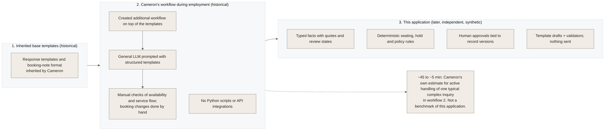

# Provenance

This document separates three things that are easy to blur: the templates Cameron inherited, the workflow he built and used during his employment, and this later application.

Editable source: [diagrams/historical_comparison.mmd](diagrams/historical_comparison.mmd).

## 1. Inherited base templates (historical)

Cameron inherited default guest-response templates and a booking-note format when he handled reservation inquiries at a restaurant. He did not write those base templates. (The employer is not named and no employer branding is used here.)

## 2. Cameron's workflow during employment (historical)

- According to Cameron, he created and implemented the additional workflow elements on top of the inherited templates. The surviving workflow notes cover structured booking notes (table, duration, status, gratuity notification, minors, accessibility, billing, occasion, contact details, who booked and confirmed), prompt shorthand and response patterns for seating offers, information requests, holds, follow-ups, cancellations, alternative times and private-dining referrals. Which individual lines were inherited and which were added is not documented line by line.
- He used general-purpose LLM chat tools with those structured prompts. **He did not use Python scripts or API integrations during his employment.**
- Availability, service flow and booking changes in the reservation platform were checked and made by hand.
- **The ~45 to ~5 minute figure is Cameron's own estimate** for active handling of one typical complex inquiry (reading and interpreting the email, checking availability and restaurant flow, updating the booking with guest details and allergens, and preparing the initial reply). How it was measured is not established. It describes workflow 2, not this application, and it is not a benchmark.
- A separate procedural improvement around double bookings and AM/PM handling was part of that history. This application does not reproduce its original cause and makes no claim about real double bookings. Testing intervals across noon and DST here is a new software capability (tests A08).

## 3. This application (later, synthetic)

- Built after that employment, in this repository, as a portfolio project. It uses a fictional restaurant ("Harbour Table Demo"), synthetic guests (`Synthetic Guest A` and so on, `example.com` addresses) and demonstration policies.
- It is **not** used by, endorsed by or connected to any restaurant or reservation platform. It has not been deployed. It sends nothing.
- A small earlier prototype (five Python modules making one classification call and one drafting call) existed before this build. It was reviewed as reference only; this application was written fresh and addresses the prototype's known weaknesses (fragile JSON parsing, unknown-category fallback, blank CSV failures, self-reported confidence, drafts that could claim unperformed confirmations).
- Development was AI-assisted: the code, tests, scenarios, labels and documentation in this build were written by an AI coding agent working from Cameron's build kit and clarifications. Git history shows who committed; it does not prove that every line was written independently. Cameron supplied the domain workflow, the requirements and the historical clarifications.

## Historical reference material

The build kit contained historical reference documents (a workflow notes file and a response-template PDF) with real business contacts and details. They were read only to understand field names and response purposes. **They are not included in this repository or its release package**, and no text, contact detail, threshold, capacity or branding from them is reproduced as current policy. Where those documents disagreed with each other, nothing was resolved in their favour; the demo configuration is independent.

## What would change these statements

- An independent review of the 60 scenario labels.
- Recorded operator sessions under `docs/study/PROTOCOL.md` (the only basis on which this project would report handling times).
- A live-model evaluation run with an explicit key and budget.
